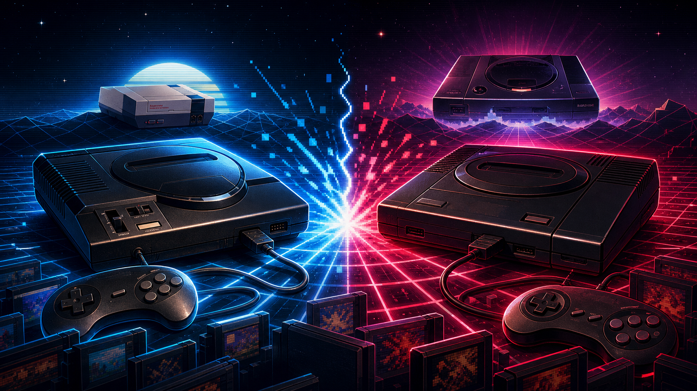

# Console Wars of the 1980s and 1990s

The console wars of the 1980s and 1990s were not just fights over plastic boxes under televisions. They were battles over who got to define what video games were, who they were for, and how the business around them would work. In roughly two decades, the industry moved from an Atari-led boom to a crash, from Nintendo's locked-down recovery to Sega's attitude-driven challenge, and then into the 3D, disc-based era where Sony rewrote the rules.

## The Crash That Set the Stage

At the beginning of the 1980s, Atari was the name most Americans associated with home video games. The Atari 2600 had made cartridge-based gaming mainstream, and competitors rushed in to chase the market. Too many companies released too many games with too little quality control. Retailers were flooded with cartridges, consumers lost confidence, and by 1983 the North American console market collapsed.

That crash mattered because it taught the next major players a brutal lesson: hardware alone was not enough. A console needed a controlled software ecosystem, recognizable characters, retailer trust, and a reason for families to believe games were worth buying again.

## Nintendo Rebuilds the Market

Nintendo entered the U.S. market carefully with the Nintendo Entertainment System in 1985. The company avoided presenting the machine as just another game console. It used terms like "Entertainment System," bundled accessories such as R.O.B. the robot, and pushed quality control through a licensing system and the Nintendo Seal of Quality.

That strategy worked. Super Mario Bros., The Legend of Zelda, Metroid, Mega Man, Castlevania, and other NES-era releases gave the machine an identity built around tight controls, colorful worlds, and replayable design. Nintendo also controlled cartridge manufacturing and restricted third-party publishers, which gave it enormous leverage. The result was a revived console market, but one dominated by Nintendo's rules.

By the late 1980s, Nintendo was not just winning. It was setting the terms of the fight.

## Sega Finds an Opening

Sega had competed in the 8-bit era with the Master System, but Nintendo's retail and licensing power made that a hard fight in North America and Japan. Sega's real breakthrough came with the Genesis, launched in North America in 1989. The system was marketed as faster, louder, sharper, and older than Nintendo's family-friendly image.

The slogan "Genesis does what Nintendon't" captured the mood. Sega leaned into arcade ports, sports games, celebrity partnerships, and an image that felt closer to MTV than Saturday morning cartoons. Sonic the Hedgehog became the perfect mascot: fast, bright, impatient, and unmistakably different from Mario.

Sega's strategy was not only technical. It was cultural. Nintendo had the trust of parents and younger children. Sega went after older kids and teenagers who wanted edge, speed, and identity. That gave the console war a personality.

## 16-Bit Turns the Fight Into Pop Culture

The Super Nintendo arrived in North America in 1991 and gave Nintendo a powerful answer to the Genesis. The SNES had richer color, strong audio capabilities, and Nintendo's biggest franchises. Super Mario World, The Legend of Zelda: A Link to the Past, Super Metroid, Donkey Kong Country, Final Fantasy VI, Chrono Trigger, and Street Fighter II helped define the system.

The Genesis fought back with Sonic sequels, sports titles, arcade action, and a marketing voice that made Nintendo look cautious. Both companies competed for third-party support, magazine covers, retail displays, and playground loyalty. Kids argued about blast processing, controller layouts, graphics, music, and which mascot would win in a fight.

This was the classic console-war moment: not just a technical comparison, but a tribal consumer culture. Owning one console often meant defending it.

## Ratings, Violence, and the Mature Market

The early 1990s also forced the industry to confront content. Games like Mortal Kombat and Night Trap became political flashpoints. Nintendo initially censored the Super Nintendo version of Mortal Kombat, while Sega allowed a blood code on the Genesis version. Sega's choice strengthened its reputation as the more rebellious brand, but it also helped intensify public scrutiny.

Congressional hearings in 1993 pushed the industry toward self-regulation, leading to the creation of the Entertainment Software Rating Board in 1994. That changed the console business permanently. Games could target older audiences more openly, while retailers and parents had a rating framework. The console wars helped mature the medium, even when the debate around games was messy and moralistic.

## The Add-On Trap

Sega's momentum weakened as it stretched the Genesis platform with add-ons. The Sega CD offered full-motion video and extra storage, but its library was uneven. The 32X promised a bridge to the next generation, but arrived too close to the Sega Saturn and confused consumers. Instead of one clear path forward, Sega gave players a stack of expensive options.

Nintendo made mistakes too, including delays and cautious moves around CD-based hardware. But Sega's add-on strategy damaged trust at the worst possible time. The market was shifting toward 3D graphics and optical discs, and consumers wanted a clean next step.

## Sony Changes the Rules

Sony entered the console market with the PlayStation in 1994 in Japan and 1995 in North America. It benefited from several industry shifts at once. CDs were cheaper to manufacture than cartridges, 3D graphics were becoming the new frontier, and many third-party developers wanted looser terms than Nintendo offered.

The PlayStation was marketed with a cooler, more adult tone than earlier consoles. It welcomed genres and styles that helped expand the audience: 3D racing, cinematic action, survival horror, rhythm games, fighting games, and role-playing games with massive presentation upgrades. Final Fantasy VII's move to PlayStation became a symbolic blow to Nintendo and a signal that third-party loyalty had changed.

Sony also understood that the console itself could be lifestyle hardware. The PlayStation did not need a mascot in the old sense. Its brand was the platform: sleek, modern, and plugged into the late-1990s culture of music, clubs, magazines, and youth media.

## Nintendo Holds Its Ground, but Loses Control

Nintendo answered with the Nintendo 64 in 1996. It produced landmark games, especially Super Mario 64, The Legend of Zelda: Ocarina of Time, GoldenEye 007, Mario Kart 64, and Super Smash Bros. The N64 proved Nintendo remained one of the best game designers in the world.

But the cartridge format limited storage and was more expensive for publishers. While cartridges had advantages in loading speed and durability, CDs gave developers more room for video, music, voice, and large worlds. Nintendo still had extraordinary first-party quality, but it no longer controlled the industry's center of gravity.

The 1990s ended with Sony leading the market, Nintendo defending a powerful but narrower identity, and Sega struggling after the Saturn's difficult launch and market performance. The Dreamcast would arrive with brilliant ideas, but the damage from the previous generation was hard to undo.

## Why the Wars Mattered

The 1980s and 1990s console wars shaped the modern game industry in several lasting ways.

First, they proved that software libraries matter more than raw hardware claims. Players remember Super Mario Bros., Sonic the Hedgehog, Street Fighter II, Final Fantasy VII, GoldenEye, and Ocarina of Time more clearly than processor specs.

Second, they turned brand identity into a weapon. Nintendo sold trust and craft. Sega sold speed and attitude. Sony sold style, CDs, and a more adult future. Modern console marketing still follows this pattern.

Third, they shifted power between platform holders and developers. Nintendo's strict control rebuilt the market after the crash, but Sony's openness helped pull third parties away. The balance between quality control, developer freedom, licensing, and platform fees remains central today.

Finally, the wars expanded the audience. The industry moved from toy aisles and arcade ports toward cinematic games, sports franchises, RPG epics, mature ratings, and living-room entertainment systems. By the end of the 1990s, consoles were no longer a fad recovering from collapse. They were a permanent cultural force.

## Bottom Line

The console wars of the 1980s and 1990s were messy, loud, creative, and commercially ruthless. Atari's collapse created the opening. Nintendo restored confidence. Sega made the fight cool. Sony made it modern. Together, they turned home gaming into one of the defining entertainment industries of the late twentieth century.
